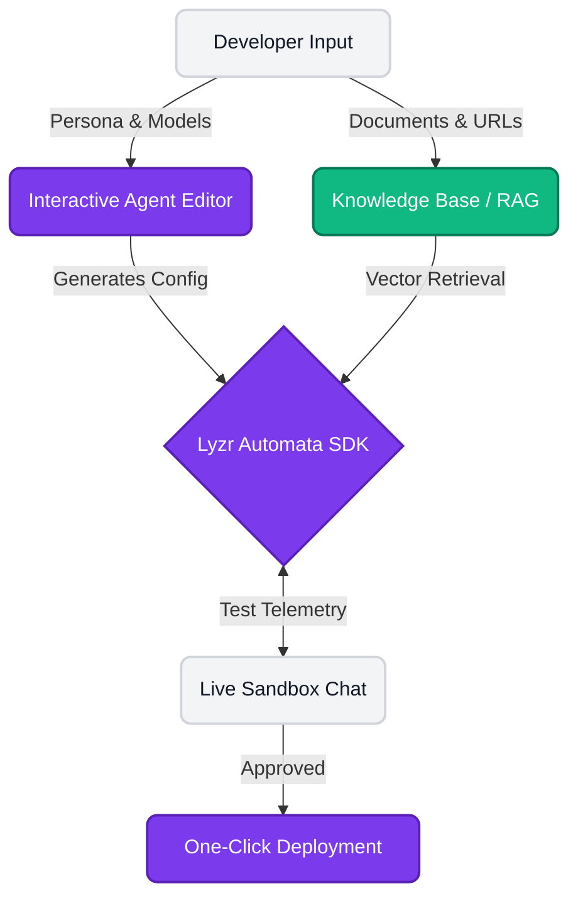

<div align="center">
  
  <h1> Lyzr Forge </h1>
  <p><strong>The Next-Gen AI Agent Developer Studio</strong></p>
  
  <p>
    
    
    
    
  </p>
</div>

<br />

##  Description

**Lyzr Forge** is a state-of-the-art, visually stunning Integrated Development Environment (IDE) built specifically for orchestrating, configuring, testing, and deploying intelligent AI agents. Designed with a premium, glassmorphic UI, it allows developers and product teams to construct context-aware agents powered by Native RAG and deploy them to production in seconds—all without writing complex infrastructure code.

---

##  Incredible Features

- **Global Mentor Assistant**: A floating, always-available AI mentor with a premium UI, ready to assist you in navigating the platform or debugging your agent configuration from any page.
- **Interactive Dual-Pane Editor**: The Editor doesn't just save state; it writes highly optimized `agent_config.py` and `rag_config.py` code dynamically as you tweak settings.
- **Live Sandbox Chat**: Test your deployed agents immediately in a production-like chat interface. Verify their behavior and RAG knowledge in real-time before releasing them to the world.
- **Immersive 3D Environments**: Features stunning, interactive 3D elements (via Spline) and highly polished micro-animations to create an unparalleled developer experience.
- **Zero-Friction RAG**: Stop worrying about chunking, embeddings, and vector databases. Lyzr Forge handles the entire Retrieval-Augmented Generation pipeline natively.

---

##  Terminologies & Technologies

We use a modern, highly performant stack to ensure maximum productivity and aesthetics:

- **Next.js & React**: The core framework for our blisteringly fast, Server-Side Rendered (SSR) frontend application.
- **Tailwind CSS**: Powers the ultra-premium design system, smooth hover elevations, and complex gradient animations.
- **Lucide Icons**: Sleek, scalable vector icons that give the UI a polished, modern tech aesthetic.
- **Lyzr Automata SDK 2.0**: The underlying AI engine that handles agent behaviors, task execution, and Large Language Model (LLM) interfacing.
- **Native RAG (Retrieval-Augmented Generation)**: The AI paradigm used to ingest external data and inject it dynamically into the agent's context.
- **Express / Node.js**: The robust backend architecture handling agent telemetry, sandbox routing, and one-click deployment pipelines.

---

##  Architecture & Implementation Plan

Our architecture is designed for a seamless, unblockable developer workflow. Here is the complete implementation lifecycle from start to finish:

1. **Phase 1: Design & Configure**
   Users start in the interactive Agent Editor. They define the agent's persona, select their preferred LLM, and adjust temperature/tokens. As parameters change, the UI syncs directly with the Lyzr Automata engine.
2. **Phase 2: Knowledge Injection (RAG)**
   Using the dedicated Knowledge tab, users upload domain-specific documents or provide URLs. The backend instantly vectors this data and attaches it to the agent's active memory pool.
3. **Phase 3: Live Sandbox Verification**
   Before deployment, the agent is tested in the Live Sandbox. This isolated environment acts as a replica of production, allowing developers to monitor latency, response accuracy, and telemetry without affecting live users.
4. **Phase 4: Export & Deployment**
   Once verified, the agent configuration is compiled into a deployable package. Developers can export it as a direct script tag (to embed in existing websites) or as a standalone backend API endpoint.



---

##  License

This project is licensed under the **MIT License**. It's the most flexible, open, and permissive license available—allowing you to build, modify, and distribute this software freely for both personal and commercial use without restriction.

```text
MIT License

Copyright (c) 2026 Lyzr Forge Contributors

Permission is hereby granted, free of charge, to any person obtaining a copy
of this software and associated documentation files (the "Software"), to deal
in the Software without restriction, including without limitation the rights
to use, copy, modify, merge, publish, distribute, sublicense, and/or sell
copies of the Software, and to permit persons to whom the Software is
furnished to do so, subject to the following conditions:

The above copyright notice and this permission notice shall be included in all
copies or substantial portions of the Software.
```
