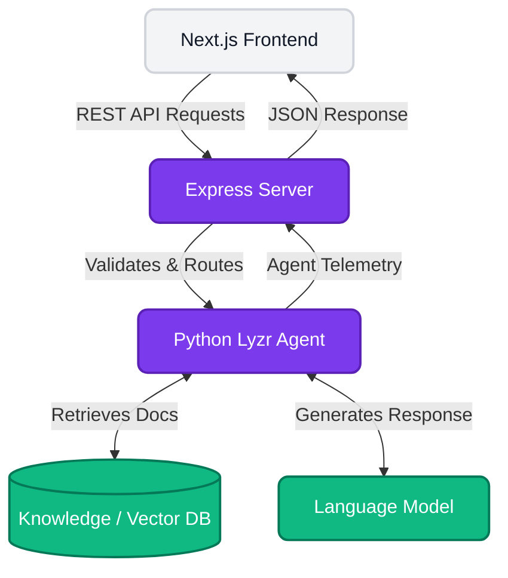

<div align="center">
  <h1>Lyzr Forge - Backend Services</h1>
  <p><strong>The Core Intelligence & API Layer for Lyzr Forge</strong></p>

  <p>
    
    
    
  </p>
</div>

<br />

##  Overview

This directory contains the robust backend architecture for Lyzr Forge. It handles agent telemetry, native RAG (Retrieval-Augmented Generation) document parsing, and provides scalable REST API endpoints to bridge the premium UI with Lyzr's Automata engine.

It is split into two main services:
- `express-server`: The Node.js API server handling frontend requests, routing, file uploads, and session telemetry.
- `python-agent`: The core intelligence layer powered by Lyzr Automata (used for configuring and orchestrating AI agents).

---

## Getting Started (Express Server)

### Prerequisites
- **Node.js** (v18 or higher recommended)
- **npm** or **yarn**

### Installation

1. Navigate to the Express server directory:
   ```bash
   cd backend/express-server
   ```
2. Install the dependencies:
   ```bash
   npm install
   ```

### Running Locally

Start the Express backend:
```bash
node server.js
```
The API server will typically start on [http://localhost:4000](http://localhost:4000).

---

##  Tech Stack

- **Node.js & Express**: Core routing and REST API services.
- **Multer**: For handling knowledge base file uploads (RAG documents).
- **PDF-Parse**: Extracting and vectoring PDF document content.
- **Python / Lyzr Automata**: Dedicated AI agent orchestration and logic.

---

## Architecture Flow



### Detailed Explanation

The backend acts as the critical bridge connecting the frontend interface to the Lyzr Automata engine.

1. **Express Server (The Gateway):** All API requests from the Next.js frontend arrive here. The Express server validates payloads, manages document uploads (via Multer), and handles preliminary data parsing before forwarding it to the orchestration layer.
2. **Python Agent (The Brain):** Leveraging Lyzr Automata, this service processes natural language requests. When a user tests their agent in the Sandbox, this Python module interacts directly with the configured Language Model (LLM).
3. **Native RAG & Vector DB:** For context-aware responses, uploaded documents are converted into vector embeddings. When queried, the Python Agent retrieves relevant document chunks from the Vector DB and injects them into the prompt, ensuring the generated responses are highly accurate and domain-specific.
