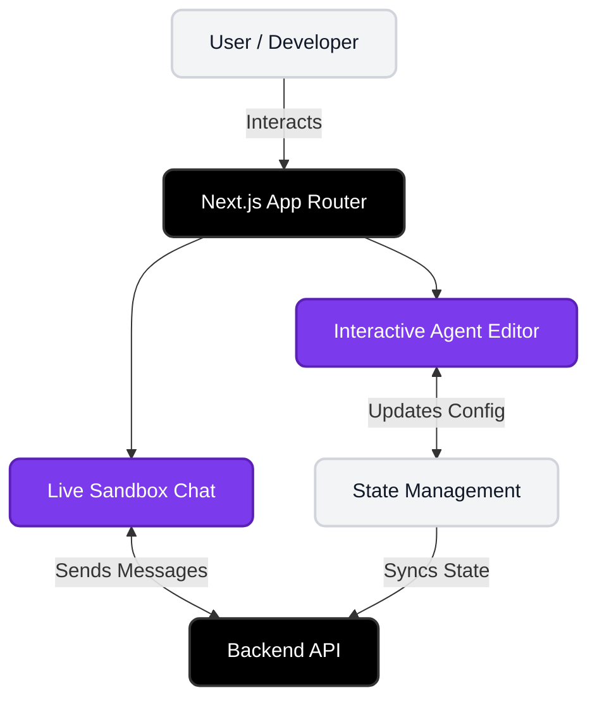

<div align="center">
  <h1>Lyzr Forge - Frontend</h1>
  <p><strong>The Premium Glassmorphic UI for Lyzr Forge</strong></p>
  
  <p>
    
    
    
  </p>
</div>

<br />

## Overview

This directory contains the **Next.js frontend** for Lyzr Forge. It features a state-of-the-art, premium glassmorphic UI designed to provide an unparalleled developer experience for orchestrating and deploying AI agents.

Key features include:
- **Interactive Dual-Pane Editor**
- **Live Sandbox Chat**
- **Immersive 3D Environments (via Spline)**

---

## Getting Started

### Prerequisites
- **Node.js** (v18 or higher recommended)
- **npm** or **yarn**

### Installation

1. Navigate to the frontend directory (if you aren't already here):
   ```bash
   cd frontend
   ```
2. Install the dependencies:
   ```bash
   npm install
   ```

### Running Locally

Start the development server:
```bash
npm run dev
```
The application will be available at [http://localhost:3000](http://localhost:3000).

---

## 🛠 Tech Stack

- **Framework**: [Next.js](https://nextjs.org/) (React)
- **Styling**: [Tailwind CSS](https://tailwindcss.com/)
- **Icons**: [Lucide React](https://lucide.dev/)
- **3D Elements**: [@splinetool/react-spline](https://spline.design/)

---

##  Project Structure

- `src/app/` - Next.js App Router layout and pages.
- `src/components/` - Reusable React components (UI elements, blocks, Agent Sandbox).
- `public/` - Static assets and icons.

---

## 🏛 Architecture & Component Flow



### Detailed Explanation

The frontend architecture relies on a highly performant **Next.js App Router** structure. 
1. **Interactive Agent Editor:** As the user tweaks agent parameters (like LLM settings or instructions), the React State captures these inputs in real-time. This dynamic syncing allows the UI to reflect changes instantly with micro-animations.
2. **State Management:** Core configuration states are managed via React contexts or hooks, ensuring the dual-pane layout remains perfectly synchronized.
3. **Live Sandbox Chat:** This component operates as an isolated execution environment. Once the agent is configured, it sends simulated chat messages directly to the Express backend (and onto Lyzr Automata) to test the agent's RAG knowledge before deployment.
